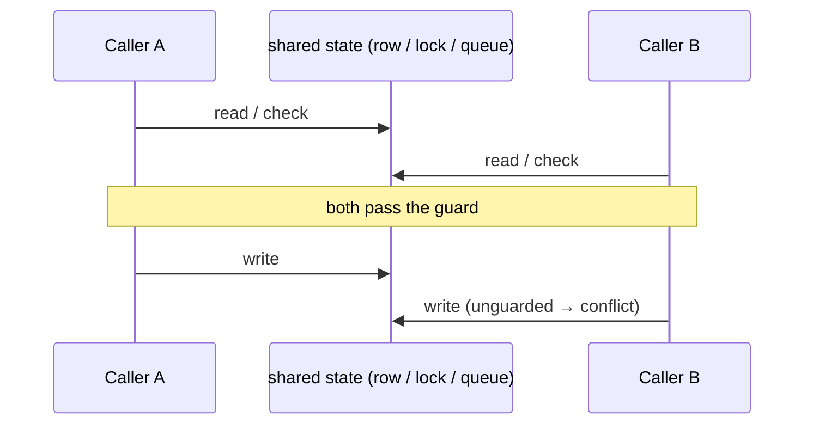
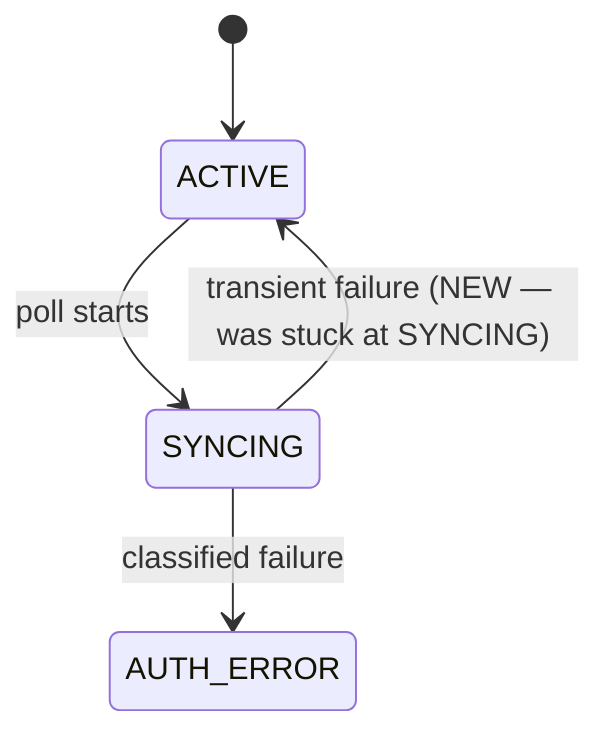
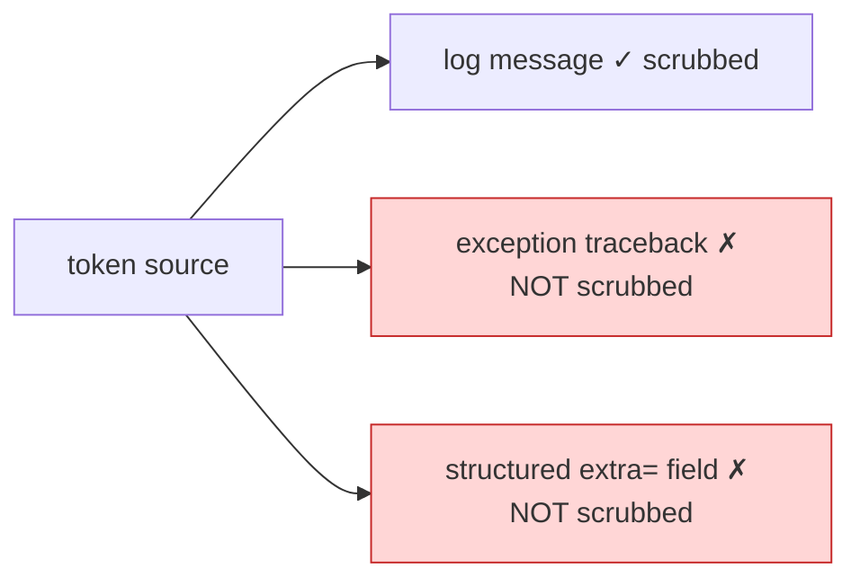

# Visualization archetypes

Pick the PRIMARY diagram from what the PR *is*. A PR can have a secondary
archetype — lead with the dominant one; a secondary archetype gets prose, not
its own diagram, unless it independently earns its space (see "When a diagram
earns its space").

| Archetype | The PR is about… | Primary visualization | Tooling |
|---|---|---|---|
| Structural | imports, coupling, architecture, cycles, fan-in | dependency diff graph + call-graph slice | SKILL Steps 3–6 |
| Behavioral / temporal | ordering, concurrency, retries, races, request lifecycle | sequence diagram (actors + shared state over time) | read code; template below |
| State-machine | a status/lifecycle field and its transitions | state diagram (states + guarded transitions) | read code; template below |
| Data-flow | secrets, taint, sanitization, transform pipeline, what reaches a sink | data-flow graph (source → transform → sink) | read code; template below |

Rules:
- Structural is the common case — run SKILL Steps 3–6.
- For behavioral / state / data-flow the dependency graph is necessary-but-
  insufficient or misleading. Lead with the matching diagram below; demote the
  dependency graph to a one-line note, or drop it if it degenerates.
- **New/substantial module is the exception** (any archetype): "drop the
  dependency graph" applies to the *module-to-module* scope only. For new code,
  still draw the **internal** function-level call graph — degeneracy is per-scope
  (a new leaf module has fan-in 0 across modules yet a rich intra-module call
  graph). See SKILL Step 2's exception.
- Always state what the chosen view *cannot* certify and route that to a human
  (e.g. "a sequence diagram shows the race window; it cannot prove the fix is
  atomic — that needs a concurrency review").

The diagrams below come from reading the changed control flow / state writes /
data path, not the bundled scripts.

## Behavioral / temporal

One lane per actor, the shared state as its own lane; put the check→act window
where two timelines can interleave:

## State-machine

The states of the lifecycle field and which transitions the PR adds or changes;
highlight the new/fixed edge:

## Data-flow

Trace the sensitive value from every source to every sink; mark the sinks the PR
does and does NOT cover. Enumerate sinks adversarially — the value of the view
is exposing the path the PR *missed*, not re-drawing the one it handled:

## When a diagram earns its space

One primary diagram per PR. Draw a second only if it independently clears the bar
below; otherwise state the secondary point in one sentence.

- Sequence: ≥2 actors that interleave on shared state. A lone call path → a
  sentence.
- State-machine: ≥3 states or ≥2 changed transitions. A single new edge (e.g. one
  `SYNCING→ACTIVE`) → a sentence ("adds a `SYNCING→ACTIVE` restore on the
  transient path"), not a diagram.
- Data-flow: ≥1 uncovered sink, or ≥3 sinks worth contrasting. One source to one
  scrubbed sink → a sentence.
- Structural: defer to SKILL's "a graph must earn its space" (no stars, no
  duplicate node sets).

## Extraction recipes — make the diagram mechanical, not freeform

Fastest path: `git diff BASE HEAD | python3 scripts/archetype_signals.py --mermaid`
emits the candidates below as JSON — guard/atomicity sites, status transitions,
secret sinks (traceback sinks flagged high-risk) — plus Mermaid scaffolds. Review
the list and fill the template; it is heuristic, so confirm each candidate. The
greps below are the same recipe by hand and document what the script looks for.

**The script sees only the diff — two blind spots you must cover by hand:**
- *Classification*: when the triggering read/check sits on an *unchanged* context
  line (e.g. a fix that adds `status = "running"` under a pre-existing
  `if status == "pending"` guard), the script sees only the added write and can
  mislabel a check-then-act race as a state-machine change. **Decide the archetype
  by reading the control flow, not by the script's label** — the table at the top
  of this file is the classifier of record.
- *Enumeration*: sinks / transitions on unchanged lines are invisible to it, so its
  list is a *lower bound*. Re-run the grep recipe over the **full touched
  function/module** (`git show HEAD:<file>`), not just the diff — the sink a partial
  "scrub" PR left untouched is exactly the unchanged line the diff hides.

Behavioral / temporal:
- Guard: in the diff, find a read/check (`.query(...).first()`, `AsyncResult`, a
  `get_*`/`is_*` helper) followed by a conditional write/dispatch (`.delay(`,
  `.commit()`, assignment to the shared field).
- Atomicity: `git show HEAD:<file> | grep -nE "with_for_update|FOR UPDATE|select_for_update|SETNX|Lock\(|\.lock\("`
  near the guard. None found → the check→act window is unguarded; draw both
  actors passing the guard.

State-machine:
- States: grep the lifecycle enum/constants — `grep -nE 'class .*Status|= "[A-Z_]+"'`.
- Transitions: every assignment to that field in the diff —
  `grep -nE '\.status ?= |status=.*\.value'`. Added/removed lines are the changed
  edges; highlight those.

Data-flow:
- Source: name the sensitive value(s) — token, secret, verifier, password.
- Sinks (check each: can the source reach it, and is it scrubbed there?):
  log message · `record.args` · `exc_info`/`exc_text`/`stack_info` (tracebacks via
  `logger.exception` / `exc_info=`) · `extra={}` structured fields · `print` ·
  `raise ...(f"...{x}")` · DB columns shown in UI (`.last_error`, `.message`) ·
  HTTP response body · Sentry `capture_*` · URLs / query strings.
- Grep: `grep -nE 'logger\.(exception|error|warning|info|debug)|print\(|raise |extra=|\.last_error|capture_'`
  over the diff and the sink module; mark red every sink the source reaches
  unscrubbed.
