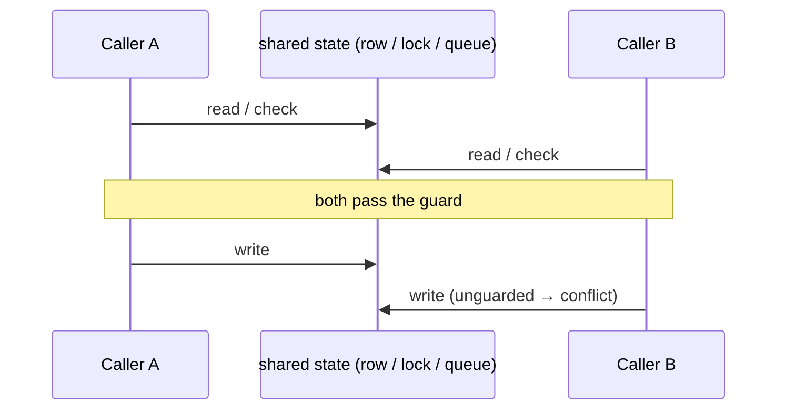
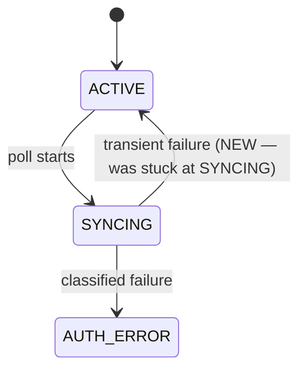
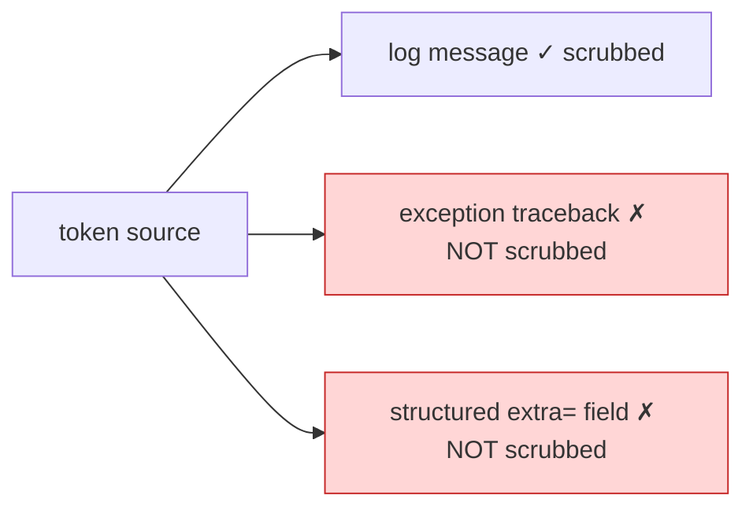

# Visualization archetypes

Pick the PRIMARY diagram from what the PR *is*. A PR can have a secondary
archetype — note it, but lead with the dominant one.

| Archetype | The PR is about… | Primary visualization | Tooling |
|---|---|---|---|
| Structural | imports, coupling, architecture, cycles, fan-in | dependency diff graph + call-graph slice | SKILL Steps 3–6 |
| Behavioral / temporal | ordering, concurrency, retries, races, request lifecycle | sequence diagram (actors + shared state over time) | read code; template below |
| State-machine | a status/lifecycle field and its transitions | state diagram (states + guarded transitions) | read code; template below |
| Data-flow | secrets, taint, sanitization, transform pipeline, what reaches a sink | data-flow graph (source → transform → sink) | read code; template below |

Rules:
- Structural is the common case — run SKILL Steps 3–6.
- For behavioral / state / data-flow the dependency graph is necessary-but-
  insufficient or misleading. Lead with the matching diagram below; demote the
  dependency graph to a one-line note, or drop it if it degenerates.
- Always state what the chosen view *cannot* certify and route that to a human
  (e.g. "a sequence diagram shows the race window; it cannot prove the fix is
  atomic — that needs a concurrency review").

The diagrams below come from reading the changed control flow / state writes /
data path, not the bundled scripts.

## Behavioral / temporal

One lane per actor, the shared state as its own lane; put the check→act window
where two timelines can interleave:

## State-machine

The states of the lifecycle field and which transitions the PR adds or changes;
highlight the new/fixed edge:

## Data-flow

Trace the sensitive value from every source to every sink; mark the sinks the PR
does and does NOT cover. Enumerate sinks adversarially — the value of the view
is exposing the path the PR *missed*, not re-drawing the one it handled:

